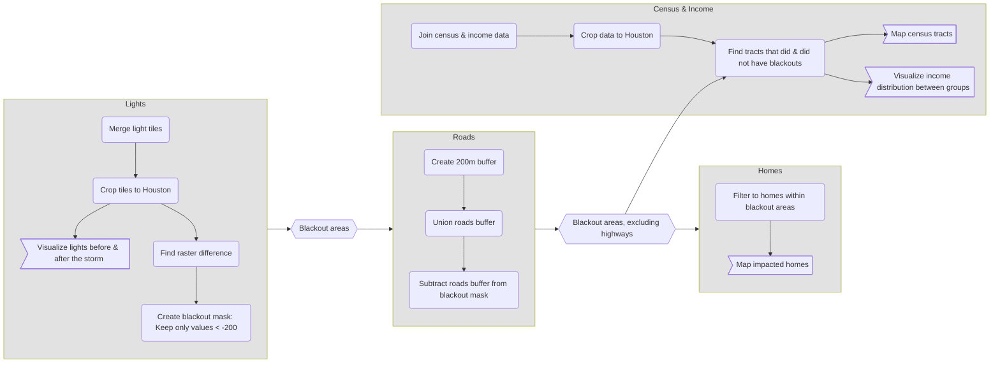

# Homework 3: 2021 Texas Blackouts

### Description

This folder contains the contents for homework 3. This homework's main goal is to analyze the disproportionate effects of the 2021 severe winter storm in Houston, Texas.

``` text
.
├── 3_texas_blackouts.Rproj
├── data
│   ├── ACS_2019_5YR_TRACT_48_TEXAS.gdb
│   ├── gis_osm_buildings_a_free_1.gpkg
│   ├── gis_osm_roads_free_1.gpkg
│   └── VNP46A1/
├── README.md
├── texas_power.pdf
└── texas_power.qmd
```

### Flowchart



### Data

-   Night lights: Data used is from February 7th & 16th, 2021, showing the before and after of the February 2021 Texas winter storm. The Visible Infrared Imaging Radiometer Suite (VIIRS) data is from NASA's Level-1 and Atmospheric Archive & Distribution System Distributed Active Archive Center (LAADS DAAC). The .tif files were downloaded and prepared by the instructors. [LAADS DAAC Website](https://ladsweb.modaps.eosdis.nasa.gov/)

-   Roads: From Geofabrik downloads site where OpenStreetMap (OSM) data can be extracted. [Geofabrik Website](https://download.geofabrik.de/)

-   Buildings: Also from [Geofabrik](https://download.geofabrik.de/), data contained are houses in the Houston area.

-   Socioeconomic: Obtained from the U.S. Census Bureau's American Community Survey for census tracts in 2019. Used for combining census attribute data to OSM geospatial data.

### References

-   Román, M.O., Wang, Z., Sun, Q., Kalb, V.L., Miller, S.D., Molthan, A., Schultz, L., Bell, J., Stokes, E.C., Pandey, B., et al. (2018). NASA’s Black Marble nighttime lights product suite (VNP46). Remote Sensing of Environment, 210, 113-143. <https://doi.org/10.1016/j.rse.2018.03.017>

-   OpenStreetMap Contributors (2025). OpenStreetMap database. Retrieved from <https://www.openstreetmap.org>. Distributed by Geofabrik GmbH, Karlsruhe, Germany. Available at <https://download.geofabrik.de/>

-   U.S. Census Bureau. (2020). TIGER/Line Shapefiles and American Community Survey 2019 (5-Year Estimates), Texas — Census Tract Level (ACS_2019_5YR_TRACT_48_TEXAS) [Data set]. U.S. Department of Commerce. Available from <https://www.census.gov/geographies/mapping-files/time-series/geo/tiger-data.html>

-   Lee CC, Maron M, Mostafavi A. Community-scale big data reveals disparate impacts of the Texas winter storm of 2021 and its managed power outage. Humanit Soc Sci Commun. 2022;9(1):335. <doi:10.1057/s41599-022-01353-8>. Epub 2022 Sep 24. PMID: 36187845; PMCID: PMC9510185.

### Author

Zach Loo
